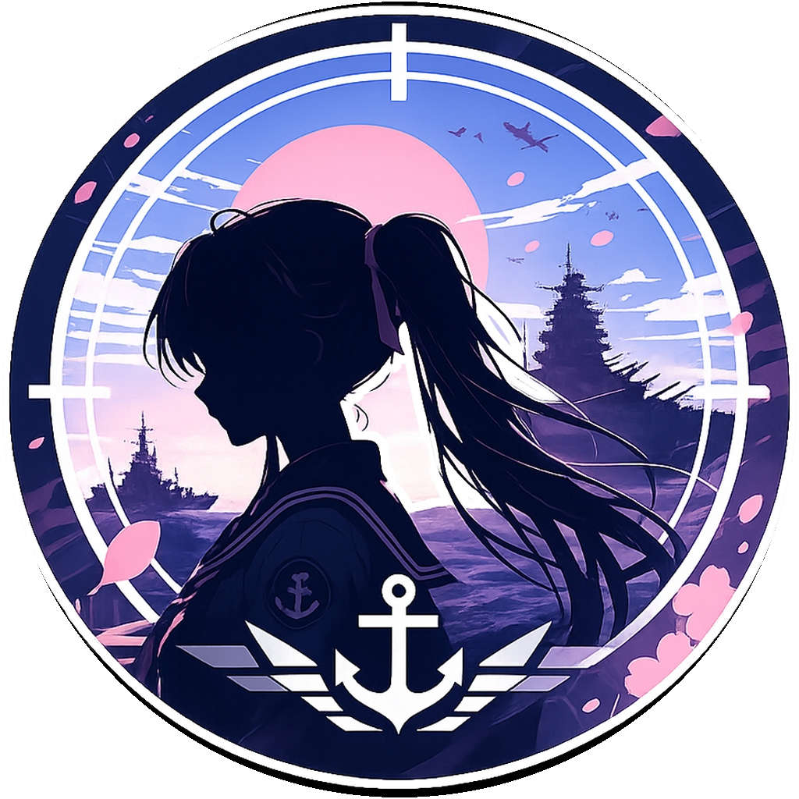
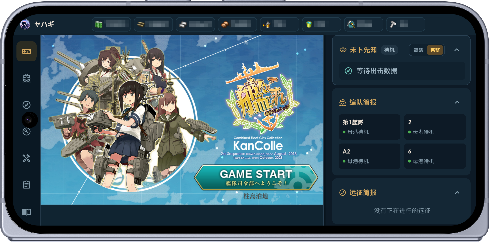
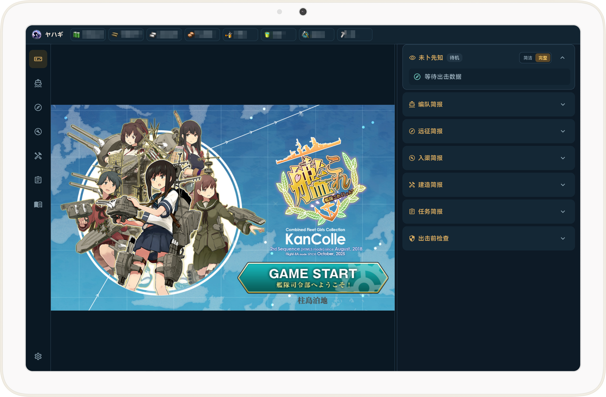
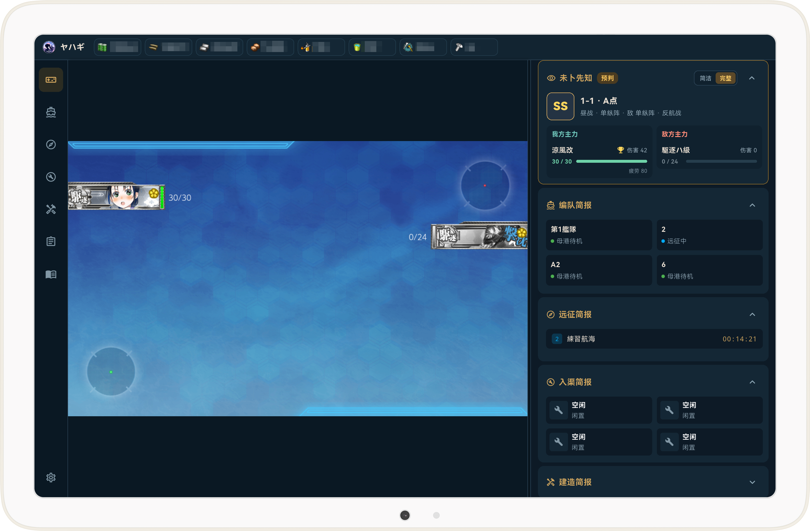
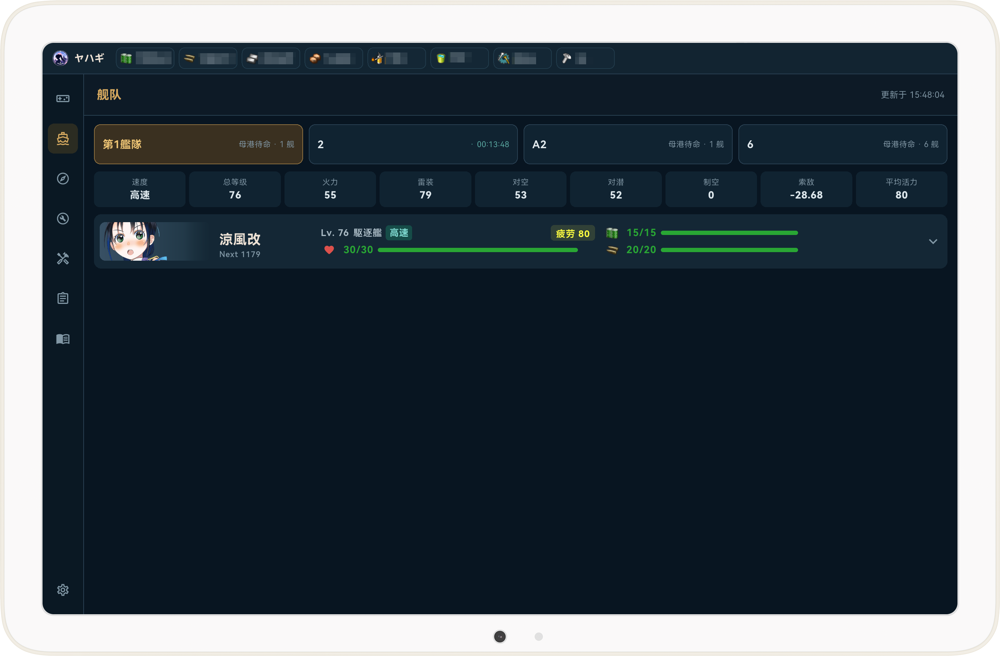
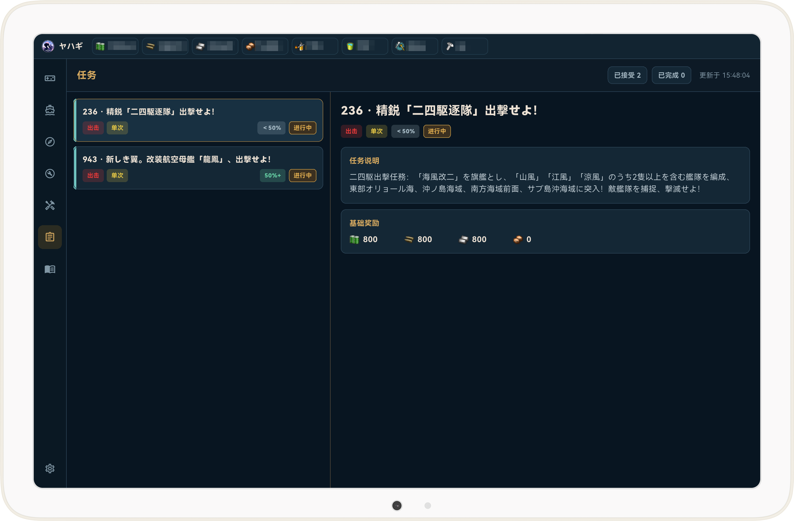

  

# ヤハギ（Yahagi KanColle Browser）

面向移动端的《舰队 Collection》非官方浏览器及本地信息辅助工具。

  <strong>🌐 其他语言 / Other Languages:</strong> 
  <strong>简体中文</strong> ｜
  <a href="README.zh-Hant.md">繁體中文</a> ｜
  <a href="README.ja.md">日本語</a>

## 软件介绍

ヤハギ（Yahagi）是一款基于 Flutter 和 Android System WebView 开发的《舰队 Collection》移动端浏览器及本地信息辅助工具。游戏网页由 Android System WebView（Chromium）加载，浏览、登录、Cookie 和页面交互方式与同设备上的 Chrome 接近；受系统 WebView 与 Chrome 版本差异影响，具体行为可能略有不同。

应用只读取游戏页面已经收到的 `/kcsapi/` 响应，用于在设备本地生成辅助信息和日志。它不会自动填写账号、点击页面、编成舰队、补给、出击或领取任务，所有游戏操作仍由玩家本人完成。

## 软件展示

### 设备适配

<table>
  <tr>
    <td width="33%" align="center">
      
    </td>
    <td width="33%" align="center">
      
    </td>
    <td width="33%" align="center">
      
    </td>
  </tr>
  <tr>
    <td align="center">一般手机</td>
    <td align="center">平板</td>
    <td align="center">折叠屏</td>
  </tr>
</table>

ヤハギ针对平板横屏、折叠屏以及游戏画面与信息面板并排使用的场景优化了布局。目前更推荐在平板和折叠屏上使用。普通手机同样可以运行，但受屏幕尺寸限制，首页能够同时展示的辅助信息不如大屏设备完整。

### 游戏与战斗辅助

点击图片可查看原图。

<table>
  <tr>
    <td width="64%" rowspan="2" align="center" valign="middle">
      
       <strong>游戏与战斗辅助</strong>
    </td>
    <td width="36%" align="center" valign="middle">
      
       编队信息
    </td>
  </tr>
  <tr>
    <td width="36%" align="center" valign="middle">
      
       任务信息
    </td>
  </tr>
</table>

## 运行模式

应用提供两种可以随时切换的运行模式：

- **游戏信息模式：** 读取游戏页面已经收到的 `/kcsapi/` 响应，启用下方列出的本地辅助功能。
- **纯浏览模式：** 关闭接口信息读取，仅使用 WebView 打开和操作游戏页面，适合只想在应用内游玩游戏的场景。

无论使用哪种模式，应用都不会代替玩家执行游戏操作。

## 核心功能

### 游戏浏览

- 使用 Android System WebView 加载 DMM 登录页和游戏页面。
- 提供返回、刷新、主页、静音和画面适配等常用控制。
- 系统自动旋转关闭时默认保持横屏；开启后随设备方向在横屏和竖屏之间切换。
- 首页功能卡片支持长按拖动，可自由调整显示顺序。
- 支持简体中文、繁体中文和日语界面。

### 舰队与作业状态

- 查看舰队成员、等级、耐久、疲劳度、燃料、弹药和装备。
- 汇总速度、火力、雷装、对空、对潜、制空和索敌等舰队信息。
- 展示远征、入渠和建造状态及剩余时间。
- 提供出击前状态检查，帮助发现需要留意的舰队状态。

### 任务信息

- 展示已接受任务、完成状态、类型、周期和服务器可确认的进度区间。
- 提供任务列表与详细说明，并展示基础奖励。
- 在设备本地保留经过解析和脱敏的任务信息。

### 战斗辅助与日志

- 记录航海节点、敌我舰队、交战状态和耐久变化。
- 根据游戏页面已经收到的数据展示战斗过程、战果等级和 MVP 预测。
- 在官方结算响应到达后，将预测更新为正式结果。
- 支持通常舰队与联合舰队，并在设备本地保存战斗记录。

### 网络与本地数据

- 支持系统网络、HTTP 代理和 SOCKS5 代理。
- 辅助数据保存在设备本地，不需要额外注册云端账号。
- 支持应用内版本检查，并从 GitHub Releases 获取最新版本信息。

## 数据与安全边界

- 真实网页导航仅允许 DMM 与舰队服务器的 HTTPS 来源。
- 原生捕获桥只接受白名单来源和 `/kcsapi/` 路径。
- 页面端、Android 端和 Dart 端会清理 `api_token`、`api_starttime` 等敏感参数。
- 应用不会读取或导出 Cookie、登录表单和完整请求头。
- 捕获逻辑不阻断、不重放、不修改游戏通信，也不会代替玩家操作游戏。
- Android System WebView 仍可能按照系统默认行为保存登录 Cookie。

## 获取应用

请前往 [GitHub Releases](https://github.com/yamatosaki/yahagi-kancolle-browser/releases) 查看已发布版本和安装包。

## 未来开发计划

目前作者预想的主要功能已经基本实现，但项目仍可能存在尚未发现或测试覆盖不足的 Bug。欢迎通过 Issue 分享使用反馈、兼容性问题和功能建议；作者会根据实际情况继续修改、优化和更新。

iOS 版本目前处于计划阶段。 由于作者暂时没有 Mac 及其他 iOS 开发环境设备，相关开发和测试仍需要一段时间。

HarmonyOS 版本也可能在未来进行可行性调研，但目前尚无明确的开发计划和时间表。

如果您在使用本应用的过程中发现任何问题，或有功能优化建议及新增功能需求，欢迎通过以下邮箱与我联系。我会认真查看并尽可能及时回复。

yamatosaki123[AT] gmail.com

## 开源与贡献

ヤハギ以开放源代码的方式开发。欢迎通过以下方式参与项目：

- 提交 Issue，报告错误或提出功能建议。
- 提交 Pull Request，改进功能、兼容性、文档或本地化。
- 在不同 Android 设备和 WebView 版本上测试，并反馈运行情况。

参与开发前请阅读 [贡献指南](CONTRIBUTING.md) 和 [安全政策](SECURITY.md)。

项目源代码使用 [MIT License](LICENSE)。第三方字体、依赖及其他资产的说明见 [THIRD_PARTY_NOTICES](THIRD_PARTY_NOTICES)。

## 免责声明

ヤハギ是由社区开发的非官方工具，与《舰队 Collection》运营方、开发方、DMM 及相关权利方不存在隶属、授权或合作关系。
使用者应自行了解并遵守相关服务条款，并承担使用第三方工具可能产生的账号、网络和兼容性风险。游戏名称、商标及第三方素材的相关权利归各自权利人所有。

## 致谢

特别感谢 [POI 浏览器](https://github.com/poooi/poi) 项目及其开源社区。POI 长期以来通过开放源代码推动《舰队 Collection》社区工具的发展，在数据组织、功能设计和社区协作等方面为本项目提供了宝贵的参考与启发。
同时感谢 Flutter、WebView Flutter 及本项目所有依赖库的维护者，也感谢每一位参与测试、反馈问题和贡献代码的用户。
ヤハギ是独立开发的项目，项目观点与实现不代表上述项目或社区的官方立场。
